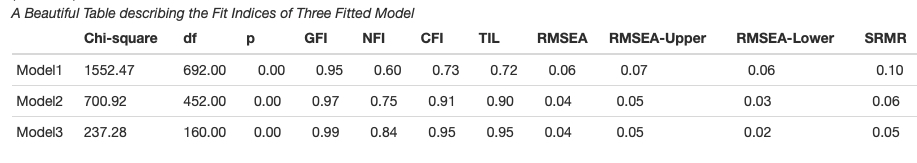
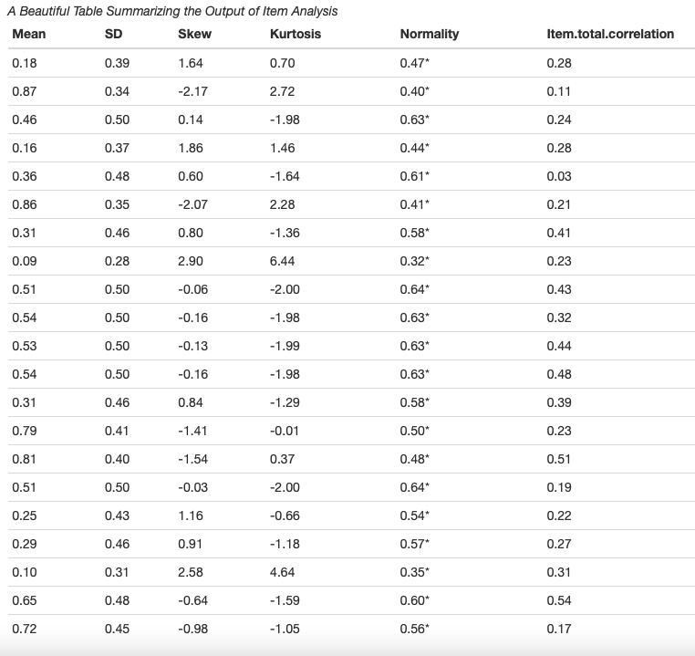

# tabledown

<!-- badges: start -->

[](https://lifecycle.r-lib.org/articles/stages.html#stable)  [](https://choosealicense.com/) [](https://cran.r-project.org/package=tabledown)
[](https://github.com/masiraji/tabledown/actions/workflows/R-CMD-check.yaml)
<!-- badges: end -->

This package is a companion R package for the Book " Basic and Advanced Psychometrics in R" [work in Progress]

This package includes data-frames and some interesting functions to create publication-friendly summary tables for factor analysis, confirmatory factor analysis and item analysis.

## Installation

You can install stable version from CRAN

``` r
install.package("tabledown")
```

You can install the development version of tabledown from [GitHub](https://github.com/) with:

``` r
# install.packages("devtools")
devtools::install_github("masiraji/tabledown")
```

## Examples

### Creating Publication Ready Plots for Item Response Theory (IRT) Models.

IRT analysis is highly depended on visual representation of the model parameters.
`mirt` package provides lots of useful functions to conduct IRT analysis.
`tabledown` package offers `ggplot2` based plotting options using `mirt` package based model parameters to facilitate the customization of the plots.

Let's create a APA publication focused ggplot theme for our plots:

``` r
library(ggplot2)
#Creating a custom theme to be used for the plots
apatheme=theme_bw()+
  theme(panel.grid.major=element_blank(),
        panel.grid.minor=element_blank(),
        panel.background=element_blank(),
        axis.text.x=element_text(size=10),
        axis.text.y=element_text(size=10),
        axis.title.x=element_text(size=10),
        axis.title.y=element_text(size=10),
        plot.title=element_text(siz=10),
        legend.text=element_text(size=10),
        legend.title=element_blank(),
        axis.line.x=element_line(color='black'),
        axis.line.y=element_line(color='black'),
        panel.border=element_rect(color="black",
                                    fill=NA,
                                    size=1))
```

Here we used `FFMQ.CFA` data frame which is a demo-validation data for Five Facet Mindfulness Questionnaire.

``` r
#Load the data
data <- tabledown::FFMQ.CFA %>% dplyr::select(item1, item6, item11, item15, item20, item26, item31, item36)
```

We used `mirt` package to run our unidimensional IRT model.

``` r
#Conduct the IRT analysis using mirt package

model <- mirt::mirt(data, model=1, itemtype='graded', 
                    SE=TRUE, Se.type ='MHRM',
                    technical=list(NCYCLES=10000))
```

Let's create some item response theory based plots know about test information.
item characteristic, item information and reliability curve.

#### Plot Item Characteristic Curve (ICC)

`tabledown` offers `ggicc` function to create `ggplot2` based Item Characteristic Curve.
`ggicc` function takes three arguments (a) model: your IRT model (B) item number (C) Theta range: `ggicc` use a symmetric theta range.
Theta = 6 will plot the ICC with a theta range of -6 to 6.

``` r
icc <- tabledown::ggicc(model, 2, 6)+apatheme
```

#### Plot Item Information Curve (IIC)

`tabledown` offers `ggiteminfo` function to create `ggplot2` based item information curve.
The arguments for `ggiteminfo` are similar to the arguments of`ggicc` function

``` r
iic <- tabledown::ggiteminfo(model, 2, 6)+geom_area()+aes(fill =  "#E64B3599")+theme(legend.position="none")+apatheme
```

#### Plot Test Information Curve (TIC)

`tabledown` also offers `ggitestinfo` and `ggitestinfo_se` function to create `ggplot2` based test information curve.
`ggitestinfo_se` will give you a test information plot with standard error of measurement.
The arguments for `ggiteminfo` are similar to the arguments of`ggicc` function

``` r
tic <- tabledown::ggtestinfo_se(data, model)+labs(title="Test Information Curve")+geom_area(fill="blue", alpha=.5)+apatheme
```

#### Plot Reliability Curve

Using `ggreliability` function a reliability curve can easily developed.

``` r
reliability <- tabledown::ggreliability(data, model)+labs(title="Reliability Curve")+geom_area(fill="grey", alpha=.5)+apatheme
```


### Creating A Summary Table for Factor Analysis

Commonly it is very difficult to create a publication friendly table that summaries all necessary information of a factor analysis.
This example will help you in that pursuit with the help of **fac.tab()** function

    library(tabledown)
    library(tidyverse)
    library(psych)
    library(papaja)

    Load the data from tabledown package
    data <- tabledown::Rotter[, 11:31]

    Create a correlational matrix to compute factor analysis
    correlations <- psych::polychoric(data, correct=0)

    fa.5F.1 <- psych::fa(r=correlations$rho, nfactors=5, fm="pa",rotate="varimax",
    residuals=TRUE, SMC=TRUE, n.obs =428)


    table <- tabledown::fac.tab(fa.5F.1, .3, complexity = F)

    papaja::apa_table(table, caption="A Beautiful Table describing the Fator analysis Output ")


### Creating A Summary Table of Fit indices in Confirmatory Factor Analysis

When reporting the confirmatory factor analysis results, modern psychometrics suggest fitting several possible structural models of the latent construct and reporting the fit indices for them. 
[**lavaan**](https://github.com/yrosseel/lavaan) package does a fantastic job doing the confirmatory factor analysis.
Here we will see how to create a publication friendly summary of fit indices from several fitted models using **cfa.tab.multi()** function.

    {Load required packages}
    library(tabledown)
    library(tidyverse)
    library(lavaan)
    library(papaja)

    load the data
    data <- tabledown::FFMQ.CFA

     First CFA model

    FF.model.Original <- 
    "Observe =~ item1 + item6 + item11 + item15 +item20 + item26 + item31 + item 36
    Describe =~ item2 + item7 + Ritem12 + Ritem16 + Ritem22 + item27 +
    item32 + item37
    Awareness =~ Ritem5 + Ritem8 + Ritem13 + Ritem18 + Ritem23 + Ritem28 + Ritem34 + Ritem38
    Nonjudge =~ Ritem3 + Ritem10 + Ritem14 + Ritem17 + Ritem25 + Ritem30+ Ritem35 + Ritem39
    Nonreact =~ item4 + item9 + item19 + item21 + item24 + item29 + item33 "

    fit.original <- lavaan::cfa(FF.model.Original, data=data, estimator="MLR", mimic="Mplus")

     Second CFA Model
    FF.model.Cor <-  "Observe =~ item1 + item6 + item11 + item15 +item20 + item26 + item31 + item 36
    Describe =~ item2 + item7   + item27 + item32 + item37
    Awareness =~ Ritem5 + Ritem8 + Ritem13 + Ritem18 + Ritem23 +Ritem28 + Ritem34
    Nonjudge =~  Ritem10 + Ritem14 + Ritem25 + Ritem30+ Ritem35
    Nonreact =~ item4 + item9 + item19 + item21 + item24 + item29 + item33
    Ritem28 ~~ Ritem34
    Ritem23 ~~ Ritem34"
    fit.Cor <- lavaan::cfa(FF.model.Cor, data = data, estimator = "MLR", mimic = "Mplus")

     Third CFA Model

    FF.short <- "Observe =~ item36 + item26 +item20 + item11
    Describe =~ item2 + item7 + item27 +  item32
    Awareness =~  Ritem8 + Ritem13 + Ritem23 + Ritem28
    Nonjudge =~ Ritem10  + Ritem25 + Ritem30 + Ritem35
    Nonreact =~ item9 + item19 + item21 + item24"

    fit.short <- lavaan::cfa(FF.short, data=data, estimator="MLR", mimic="Mplus")

    # Creating Summary table of fit indices from three fitted model (lavaan class objects)

    table <- cfa.tab.multi(fit.original, fit.Cor, fit.short, robust= TRUE)

    papaja::apa_table(table, caption="A Beautiful Table describing the Fit Indices of Three Fitted Model")



### Creating Summary Table for Item Analysis

In psychometrics conducting item-analysis is very common. 
[**psych**](https://Cran.R-project.org/package=psych) packages have provided enough tools to run the item analysis smoothly.
Here we will create a publication friendly summary table of item analysis with all necessary information using function **des.tab()**

     library(tabledown) 
     library(tidyverse) 
     library(psych)

    data <- tabledown::Rotter[, 11:31] 

    table <- des.tab(data) papaja::apa_table(table, caption="A Beautiful Table Summarizing the Output of Item Analysis")


